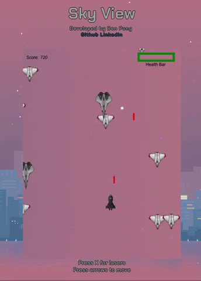

[Live demo!](benpong.com/sky_view)

Single page Javascript game. Incorporates Canvas and Javascript logic to achieve a nostalgic arcade-shooter user experience. Utilizes Google Firebase to store high scores. The core of features of this app include Canvas shapes and sprites rendering, JavaScript logic to incorporate collisions, and key input handling for user game play.

Future improvements include:

1.  Additional enemy types.
2.  Explosion graphics.
3.  Sound effects on collision.
